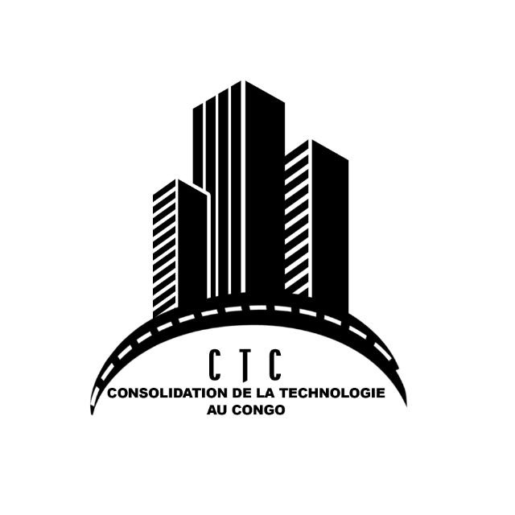

  

# Site officiel de la Consolidation de la Technologie au Congo (CTC)

Bienvenue sur le dépôt officiel de notre site.  
La **Consolidation de la Technologie au Congo (CTC)** est une entreprise spécialisée dans la **consultance** et le développement de solutions innovantes au service du progrès au Congo.

---

## 🌍 Nos Domaines d’Activité

- 🏗️ **Construction** : bâtiments, infrastructures publiques et privées.  
- 🪑 **Mobilier** : conception et fourniture de mobiliers adaptés aux besoins modernes.  
- 🚧 **Travaux publics** : routes, chaussées et aménagements urbains.  
- 💧 **Hydraulique & Assainissement** : adduction en eau potable, gestion des eaux usées.  
- 🖥️ **Nouvelles technologies** : solutions numériques et connectivité.  

---

## 🎯 Notre Mission
Accompagner le développement du Congo en apportant des solutions durables, modernes et adaptées aux besoins locaux.  

---

## 📞 Contact
- Email : **[ajoute ton email ici]**  
- Téléphone : **[ajoute ton numéro ici]**  
- Adresse : **[ajoute ton adresse ici]**

---
